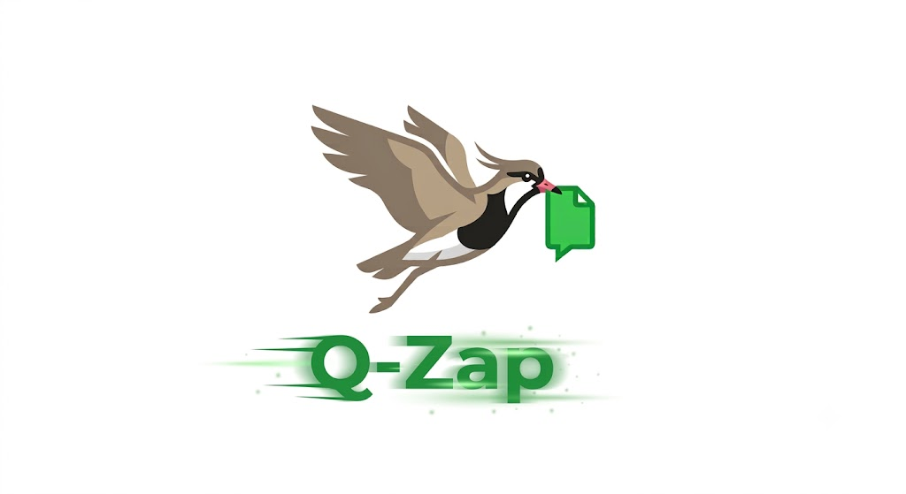

  

# Q-Zap

Serviço de envio automático de documentos (notas fiscais, boletos, etc.) gerados por sistemas ERP legados para clientes via WhatsApp, usando a Evolution API.

Resolve a falta de integração nativa com WhatsApp em sistemas antigos: o ERP apenas salva o documento em uma pasta, e o Q-Zap cuida de identificar o cliente e enviar o arquivo automaticamente, sem exigir nenhuma alteração no ERP.

## Status atual

Projeto em fase de planejamento. Requisitos e etapas de desenvolvimento já definidos; implementação ainda não iniciada.

## Como funciona (resumo)

1. O ERP (via editor de relatórios, ex: Crystal Reports) salva um PDF na pasta monitorada. O nome do arquivo é irrelevante; o PDF pode conter o documento de um único cliente ou, em geração em lote (ex: boletos do mês), os documentos de vários clientes concatenados.
2. O Q-Zap extrai, da camada de texto de cada página, um marcador no formato `$Q-Zap=numero|nome$`, e agrupa páginas consecutivas com o mesmo marcador em um documento por cliente.
3. Se uma página não tiver marcador válido (ausente, malformado ou com dado inválido), apenas aquele documento é movido para uma pasta de erro, sem afetar os demais do mesmo lote.
4. Para cada documento identificado, o Q-Zap monta uma mensagem a partir de um template configurável e envia o documento como anexo pelo WhatsApp, via Evolution API rodando localmente.
5. Após o envio confirmado, o documento é movido para uma pasta de enviados; quando todos os documentos de um arquivo de entrada forem concluídos, o arquivo original é movido para uma pasta de processados.

O envio segue um conjunto de regras de throttling e comportamento (delay entre mensagens, indicador de digitação, limite diário, circuit breaker em caso de instabilidade) para reduzir o risco de bloqueio do número no WhatsApp.

## Documentação

- [`docs/Contexto.md`](./docs/Contexto.md) — contexto e motivação inicial do projeto.
- [`docs/PRD.md`](./docs/PRD.md) — requisitos funcionais e não funcionais, escopo, fluxo do sistema e critérios de aceite.
- [`docs/DEV_PLAN.md`](./docs/DEV_PLAN.md) — etapas de desenvolvimento planejadas, da configuração inicial ao instalador para novos clientes.
- [`docs/WHATSAPP_EVOAPI_ANTIBAN_GUIDELINES.md`](./docs/WHATSAPP_EVOAPI_ANTIBAN_GUIDELINES.md) — regras de referência para uso seguro da Evolution API, usadas como base para as proteções anti-ban do projeto.

## Stack

- Node.js (runtime)
- Evolution API, rodando localmente via Docker, na mesma máquina do Q-Zap

Detalhes de bibliotecas e decisões de configuração estão em [`docs/DEV_PLAN.md`](./docs/DEV_PLAN.md).

## Instalação

Ainda não implementada. O objetivo definido no PRD é que a instalação em uma máquina nova exija apenas executar um único comando e responder a algumas perguntas feitas por ele (pasta base, número administrador, limite diário), sem precisar editar o `.env` manualmente, além do pareamento inicial do WhatsApp via QR code. Ver Etapa 11 em [`docs/DEV_PLAN.md`](./docs/DEV_PLAN.md).

## Estrutura de dados esperada

- Marcador `$Q-Zap=numero|nome$` embutido na camada de texto de cada página do PDF (via template do editor de relatórios do ERP) — não há mais cadastro externo de clientes.
- `template.txt` — texto da mensagem enviada junto com o documento, com placeholder `{nome}`.
- `.env` — configuração operacional (`PASTA_BASE`, acesso à Evolution API, delays, limites, número administrador). As subpastas `entrada/`, `enviados/`, `erro/`, `processado/` e `logs/` são criadas automaticamente dentro de `PASTA_BASE`.

## Escopo da v1

Fora do escopo por enquanto: integração direta com o ERP, tratamento de respostas dos clientes no WhatsApp, interface gráfica de administração, opt-in/opt-out formal, múltiplos números em rotação e migração para a Meta Cloud API oficial. Detalhes em [`docs/PRD.md`](./docs/PRD.md).
